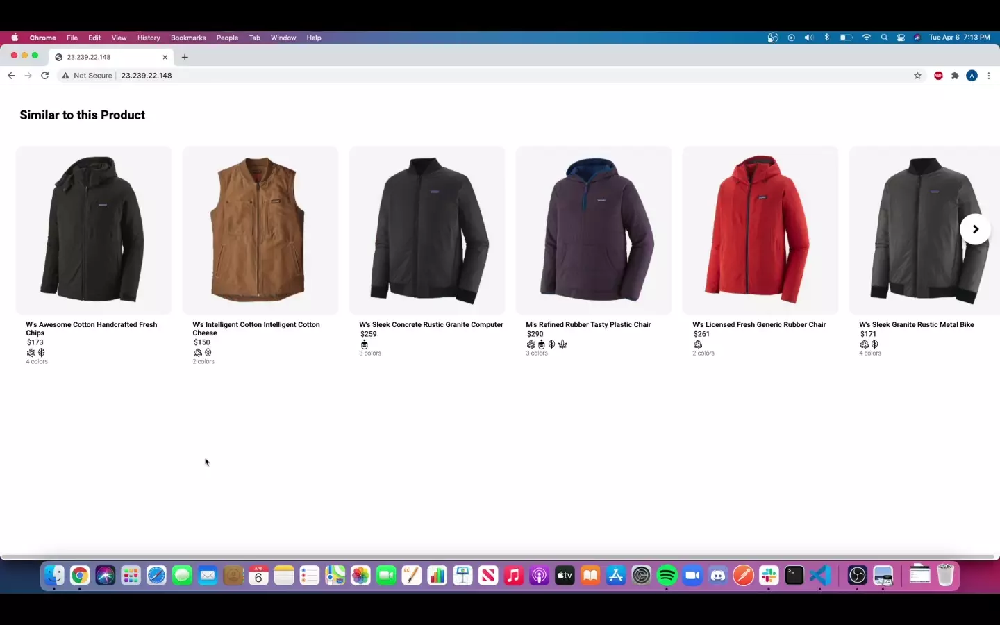

# Fjords by LibraFX

> HackReactors F.E.C. project conducted by team LibraFX: Alex Klyuev, Alex Yu, Samuel Bjorklund, Zachary Cush.
Recreation of Patagonia's Fjord Flannel Jacket item page featuring the selected item carousel, detailed overview, similar products, and customer reviews;
handled by ZC, AY, AK, and SB respectively. Project designed as a non-functional Full-stack application using Node.JS, React, and a simulated Mongo database.
Implemented in a Service-Oriented Architecture.

Similar Products module:



Deployed with Docker & Linode: http://23.239.22.148

## Related Projects

  - https://github.com/LibraFX/size-carousel
  - https://github.com/LibraFX/overview
  - https://github.com/LibraFX/reviews

## Installation for Local Use

From within the root directory:

```sh
npm install
npm build
npm start
```

## Dependencies

MongoDB
